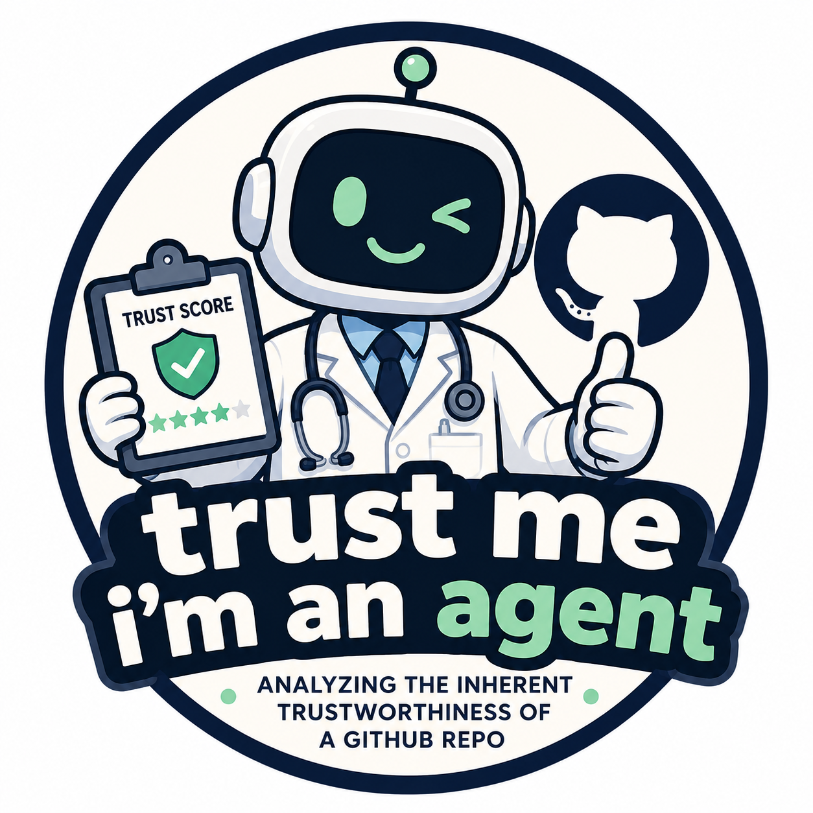

<p align="center">
  
</p>

# Trust Swarm

A subagent swarm that assesses the trustworthiness of any AI/agentic GitHub repository against a 22-risk evaluation framework. Point it at a repo and get back a structured report: per-risk verdicts with evidence, domain scorecards, compound risk analysis, and an overall GREEN / AMBER / RED verdict.

---

## How it works

Three sequential phases. Phase 2 runs in parallel.

```
GitHub URL
    │
    ▼
[Phase 1] Repo Reader          (claude-sonnet-4-6)
    │  Fetches repo via GitHub API → structured trust brief
    │
    ▼
[Phase 2] 5 Domain Specialists (claude-sonnet-4-6 × 5, parallel)
    ├── Security
    ├── Reliability
    ├── Transparency & Fairness
    ├── Accountability
    └── Human Factors
    │
    ▼
[Phase 3] Holistic Specialist  (claude-opus-4-7)
    │  Reviews all 5 domain reports → compound/emergent risk analysis
    │
    ▼
Markdown report (stdout) + trust_report.json
```

The Repo Reader fetches up to 50 files (100 KB cap), prioritising `agent`, `prompt`, `system`, `iam`, `policy`, `config`, `handler`, `orchestrat`, and `README` paths. Domain specialist prompts are generated programmatically from the risk definitions — no manual per-risk prompt writing.

---

## The 22 risks

| Domain | Risks assessed |
|--------|---------------|
| **Security** | Agent Hijacking & Prompt Injection · Tool Misuse & Confused Deputy · Data Leakage / Data Protection Breach · Model Extraction / Evasion Attacks · Memory & Data Poisoning |
| **Reliability** | System Instability · Silent Failures · Cascading Errors · Endless Cycles / Looping · Role & Specification Drift · Reasoning-Action Mismatch |
| **Transparency & Fairness** | Algorithmic Bias · Obscure Logic (Black Box) · Context Rot · Goal Misalignment & Poor Definition |
| **Accountability** | Unapproved Self-Improvements · Blurred Accountability Structures · Memory Rot |
| **Human Factors** | Over/Under-Reliance & Human Oversight · Human Misuse · Human Skill Degradation · Undefined or Negative Value |

Each risk is assessed with a `PASS / CONCERN / FAIL` verdict, a severity (`critical / high / medium / low`), and cited evidence (specific file, line reference, or observable absence).

---

## Setup

```bash
pip install -r requirements.txt
cp .env.example .env
# Add your ANTHROPIC_API_KEY (required)
# Add GITHUB_TOKEN for private repos (optional)
```

---

## Usage

```bash
python -m trust_swarm https://github.com/org/repo
```

Progress is printed to stderr as each phase runs. The final Markdown report goes to stdout; `trust_report.json` is written to the current directory.

```bash
# Save the report
python -m trust_swarm https://github.com/org/repo > report.md
```

---

## Output

**Markdown report sections:**
1. Repo Overview — tech stack, agent architecture, key files, safety mechanisms, notable absences
2. Domain Scorecards — GREEN / AMBER / RED per domain with top findings
3. Risk Detail — per-risk verdict, evidence, severity for all 22 risks
4. Compound Risks — cross-domain interactions identified by the holistic specialist
5. Top Recommendations — three prioritised actions
6. Overall Verdict — GREEN / AMBER / RED

**`trust_report.json`** — full structured output including the repo brief, all domain results, and holistic analysis.

---

## Running tests

```bash
pytest
```

21 tests covering risk definitions, GitHub fetching (mocked), prompt generation, and report formatting.

---

## Requirements

- Python 3.11+
- `ANTHROPIC_API_KEY` in environment
- `GITHUB_TOKEN` for private repos (optional but recommended to avoid rate limits)
